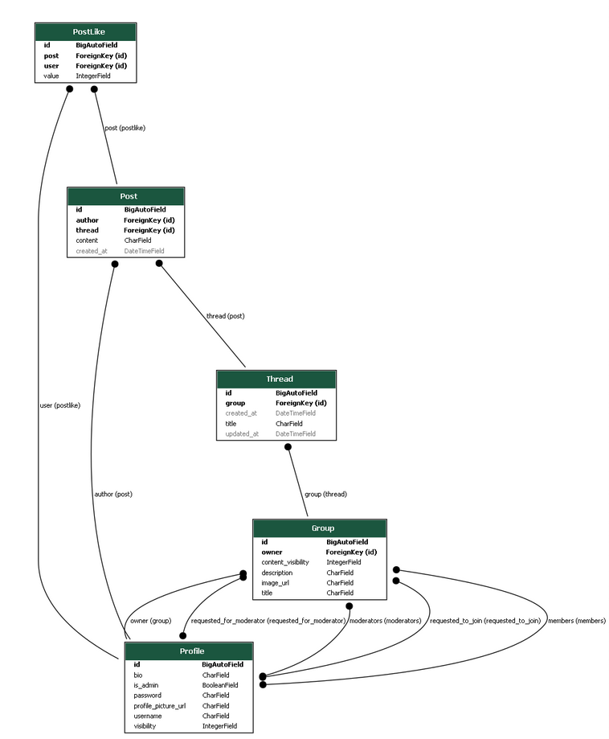

# HuDAn - Social Network

<p align="left">
    
</p>

**HuDAn** is a social network project developed for Information Systems class at BUT FIT. This Django-based application enables users to connect within groups, participate in discussions, and manage personal profiles.

---

## Table of Contents
- [HuDAn - Social Network](#hudan---social-network)
  - [Table of Contents](#table-of-contents)
  - [Authors and Contributions](#authors-and-contributions)
  - [Project Links](#project-links)
  - [Application Overview](#application-overview)
  - [System Architecture](#system-architecture)
    - [Models](#models)
    - [Views](#views)
    - [URL Routes](#url-routes)
    - [Services](#services)
  - [Installation](#installation)
    - [Server Setup](#server-setup)
  - [Software Requirements](#software-requirements)
  - [Database](#database)
    - [Database Schema](#database-schema)
    - [Database Migration](#database-migration)

---

## Authors and Contributions

- **Kristián Dobeš**  
  **Contributions:** Developed user profiles, implemented security for profiles and groups, and conducted extensive testing.

- **Ondřej Hráček**  
  **Contributions:** Designed the database schema, implemented user and group functionalities, managed threads and posts, and handled user authentication.

- **Maroš Synák**  
  **Contributions:** Developed administration and moderation tools, implemented post and user management, and organized group and thread management.

---

## Project Links

- **Original Development Repository**:  
  This repository is an extension of the original project development repository.  
  [GitHub Repository URL](https://github.com/ondrahracek/iis-hudan)

---

## Application Overview

HuDAn is a Django-powered social networking platform with the following features:

- **User Profiles**: Users can create, view, and edit profiles, with customizable privacy options.
- **Groups and Memberships**: Create groups, invite members, and manage group visibility and permissions.
- **Threads and Posts**: Group members can create threads and participate in discussions through posts.
- **Admin and Moderator Tools**: Tools are available for managing user roles, moderating posts, and handling membership requests.

---

## System Architecture

### Models

HuDAn’s data structure includes the following models:

- **Profile Model**: Stores user details like username, password, profile image URL, bio, and visibility settings.
- **Group Model**: Manages group information, including name, moderators, owner, and member lists.
- **Thread Model**: Represents discussion threads within groups, tracking timestamps and titles.
- **Post Model**: Manages individual posts within threads, tracking author, content, and timestamp.
- **PostLike Model**: Links users to posts to track likes and dislikes.

### Views

The application views include:

- **User Views**: Display and manage user profiles, account settings, and authentication processes.
- **Group Views**: Display group details, and manage creation, membership, and moderation for groups.
- **Thread Views**: Display threads within groups and manage the creation of threads and posts.

### URL Routes

Organized URL routes include:

- **User URLs**: Routes for managing user profiles, listings, and profile editing.
- **Group URLs**: Routes for creating, viewing, and editing groups and handling memberships.
- **Thread URLs**: Routes for accessing and creating threads, and managing posts.

### Services

Core services offered include:

- **User Services**: Authentication handling, including registration, login, and logout.
- **Group Services**: Group management, including creation, editing, and member moderation.
- **Thread Services**: Thread creation and post handling within groups.

---

## Installation

To install HuDAn on a server, follow these steps:

### Server Setup

1. **Create Directory**:  
   Create a directory at `/var/www/iis.cz`.

2. **Set Up Python Virtual Environment**:  
   Create a virtual environment for running Django, ensuring compatibility with Apache2.

3. **Configure Apache2**:  
   In `sites-available`, configure Apache2 as usual, adding the following lines:

    ```bash
    WSGIDaemonProcess iishudan python-home=/var/www/iis.cz/iisenv python-path=/var/www/iis.cz/hudan
    WSGIProcessGroup iishudan
    WSGIScriptAlias / /var/www/iis.cz/hudan/hudan/wsgi.py
    ```

4. **Start the Virtual Environment**:
   - Install the required Python libraries.
   - Activate the SSL certificate.
   - Open [https://iis.cz](https://iis.cz) to verify a functional Django page.

---

## Software Requirements

- **Operating System**: Linux server
- **Web Server**: Apache2
- **Framework**: Django with a pre-configured project

---

## Database

HuDAn uses an embedded **SQLite3** database.

### Database Schema

<p align="left">
    
</p>

### Database Migration

To migrate models, execute the following command:

```bash
python manage.py migrate
